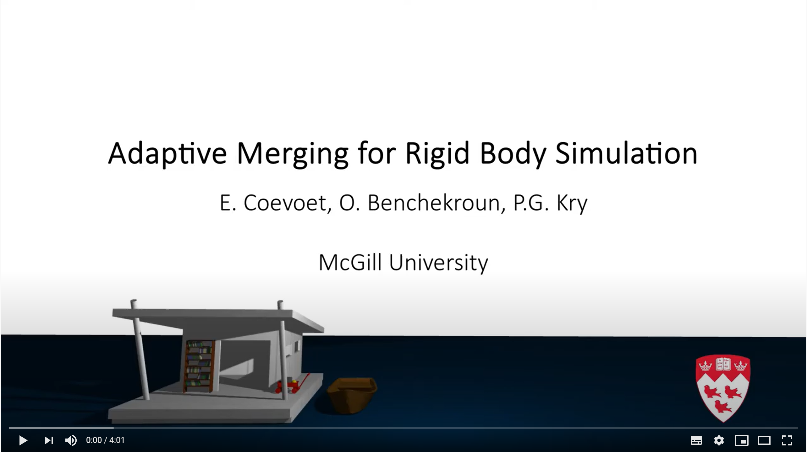

# Adaptive Merging for Rigid Body Simulation

We reduce computation time in rigid body simulations by merging collections of bodies when they share a common spatial velocity. Merging relies on monitoring the state of contacts, and a metric that compares the relative linear and angular motion of bodies based on their sizes. Unmerging relies on an inexpensive single iteration projected Gauss-Seidel sweep over contacts between merged bodies, which lets us update internal contact forces over time, and use the same metrics as merging to identify when bodies should unmerge. Furthermore we use a contact ordering for graph traversal refinement of the internal contact forces in collections, which helps to correctly identify all the bodies that must unmerge when there are impacts. The general concept of merging is similar to the common technique of sleeping and waking rigid bodies in the inertial frame, and we exploit this too, but our merging is in moving frames, and unmerging takes place at contacts between bodies rather than at the level of bodies themselves. We discuss the previous relative motion metrics in comparison to ours, and evaluate our method on a variety of scenarios.

<video width=60% controls align="center">
  <!-- Safari -->
    <source src="https://drive.google.com/uc?export=download&id=1twVsqMgFI7TO4e3aKn8OaIBVn_So_3pT" type='video/mp4'/>
    <!-- Chrome and FF -->
    <source src="https://drive.google.com/uc?export=download&id=1twVsqMgFI7TO4e3aKn8OaIBVn_So_3pT" type='video/webm'/>
    
</video>

# Information

## 3D Java Application

To test our implementation, run the Java application `src/mergingBodies3D/LCPApp3D`.
Scenes are built in XML (see the `Help` tab of the Java application for documentation) **TODO: move this doc somewhere more convenient**. Numerous examples are available in the folder `scene3D`. To make your own scene, you can also have a look at the `scenes3D/python` folder which contains a library to generate the XML, along with some examples.

## 2D Java Application

This repository also holds a 2D implementation of adaptive merging. Try to run the Java application `src/mergingBodies2D/LCPApp2D` **TODO: update**. Scenes are built from 2D pixel art `.png` images:

- Red pixels are spring. 
- Blue objects are pinned bodies.
- The shade of the color will change the density (dark for dense body).
- Green objects will be temporarily pinned.

Examples are available in `scenes2D`. 

# Authors

Eulalie Coevoet, Otman Benchekroun & Paul G. Kry

# License 

