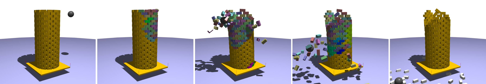
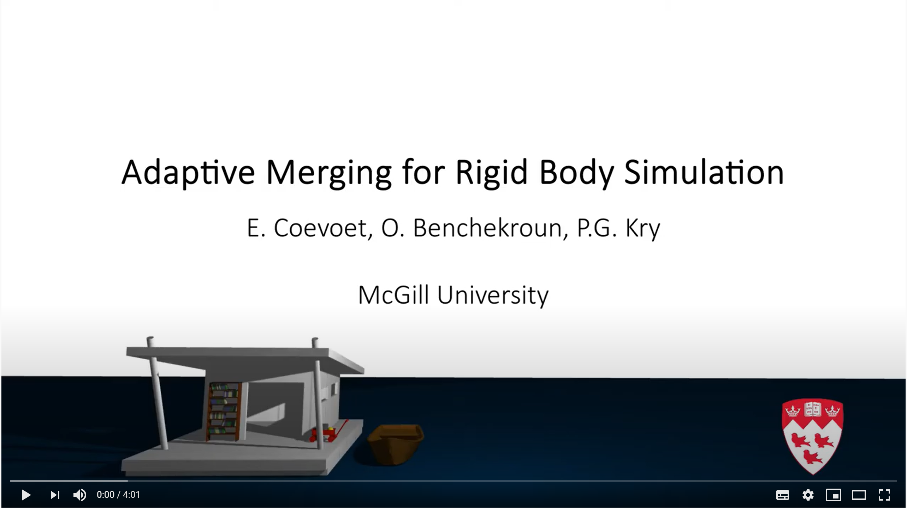
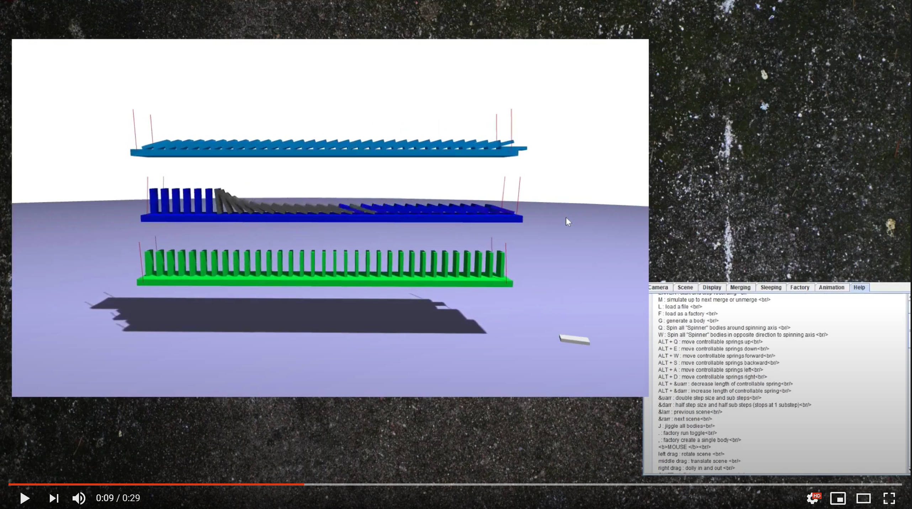

# Adaptive Merging for Rigid Body Simulation

[](https://dl.acm.org/doi/abs/10.1145/3386569.3392417?casa_token=IZlqZXM_C4UAAAAA:NigEEUkma3E9g3b4FqSfGPvcbQUqWqTYdnkDnu3mwudu9lgNpOITf0cnMo4qJYIIQQuDzvpO0YUefQ)
<!---[]()--->



## Abstract

We reduce computation time in rigid body simulations by merging collections of bodies when they share a common spatial velocity. Merging relies on monitoring the state of contacts, and a metric that compares the relative linear and angular motion of bodies based on their sizes. Unmerging relies on an inexpensive single iteration projected Gauss-Seidel sweep over contacts between merged bodies, which lets us update internal contact forces over time, and use the same metrics as merging to identify when bodies should unmerge. Furthermore we use a contact ordering for graph traversal refinement of the internal contact forces in collections, which helps to correctly identify all the bodies that must unmerge when there are impacts. The general concept of merging is similar to the common technique of sleeping and waking rigid bodies in the inertial frame, and we exploit this too, but our merging is in moving frames, and unmerging takes place at contacts between bodies rather than at the level of bodies themselves. We discuss the previous relative motion metrics in comparison to ours, and evaluate our method on a variety of scenarios.

## Video

[](https://www.youtube.com/watch?v=mmVVRVt8EF4)

## Information

### 3D Java Application

To test our implementation, you can either download the latest [release](https://github.com/EulalieCoevoet/AdaptiveMerging/releases), or download (or clone) the project and open it in your favorite IDE. For instance with [Eclipse](https://www.eclipse.org/downloads/) : 

1. Go to `File` 
2. Select `Open project from File System`
3. Browse `Directory` to AdaptiveMerging 
4. Clic `Select Folder` and finally `Finish`
5. Now you can run the Java application `src/mergingBodies3D/LCPApp3D.java`. Right click on the file and `Run As\Java Application`

Unfortunately if you are using MacOS you may not be able to interact with the objects in the scene, we are currently working on the issue.

Numerous examples are available in the folder `scene3D` or with the release. The scenes are built using XML (see `scenes3D\README.md` for more info).
If you want to build your own scene, you can also have a look at the `scenes3D/python` folder which contains tools to generate the XML, along with some examples.

### 2D Java Application

This repository also holds a 2D implementation of adaptive merging. You can try it by running the Java application `src/mergingBodies2D/LCPApp2D.java`, just note that the implementation in 2D is **not up to date** with what is described in the paper. Many examples are provided in the `scenes2D` folder, which contains a `README.md` file with more details on how to make your own scene.

## Replicability

You can reproduce Figure 7 of the paper, _Dominoes falling on slightly swinging platforms_, by following the following instructions:
1. Open the 3D Java application and load the scene `scenes3D/dominoesPlatforms.xml`
2. Press space to start the simulation 
3. Let the dominoes merge, as shown in the following video  
4. Once the dominoes have merged with the platforms, whenever you're ready, press shift and left click on the top left domino,
drag it to the right to make it fall. 

Note that you can press up/down key to accelerate/slow down the simulation. 

[](https://www.youtube.com/embed/JFonUZKp0QM)

## Authors

[Eulalie Coevoet](https://eulaliecoevoet.com/), Otman Benchekroun & [Paul G. Kry](https://www.cs.mcgill.ca/~kry/)

## Bibtex

```@article{coevoet2020merging,
title = {Adaptive Merging for Rigid Body Simulation},
author = {Coevoet, Eulalie and Benchekroun, Otman and Kry, Paul G.},
journal = {ACM Transactions on Graphics (TOG)},
volume = {39},
number = {4},
numpages = {13},
articleno = {35},
year = {2020},
publisher = {ACM New York, NY, USA}
}
```
